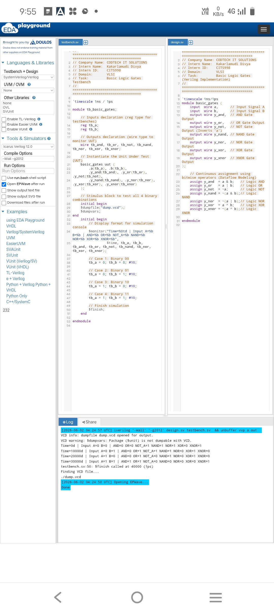

# Codtech_basic_logic_gates
BASIC LOGIC GATES
# Basic Logic Gates Implementation using Verilog HDL

## 📌 Project Overview
- **Company Name:** CODTECH IT SOLUTIONS
- **Intern Name:** Kakarlamudi Divya
- **Intern ID:** CITS998
- **Domain:** VLSI
- **Task:** Basic Logic Gates Implementation and Testbench Verification

---

## 📂 Circuit Description
The design implements the following fundamental gates using continuous assignment (`assign` statements) with bitwise operators:

1. **AND Gate** (`a & b`)
2. **OR Gate** (`a | b`)
3. **NOT Gate** (`~a` - Inverts Input A)
4. **NAND Gate** (`~(a & b)`)
5. **NOR Gate** (`~(a | b)`)
6. **XOR Gate** (`a ^ b`)
7. **XNOR Gate** (`~(a ^ b)`)

---

## 💻 Code Structure

### 1. RTL Design (`design.sv`)
Defines the module structure, input/output ports, and the concurrent boolean expressions for each logic gate.

### 2. Testbench (`testbench.sv`)
Generates stimulus for all four binary combinations (\(2^2 = 4\)) with a 10ns time delay between each state. It also features:
- `$monitor` for real-time terminal logging.
- `$dumpfile` and `$dumpvars` to generate `dump.vcd` for waveform analysis.

---

## 📊 Verification & Results
   


### Truth Table Reference


| Time (ns) | Input A | Input B | AND | OR | NOT_A | NAND | NOR | XOR | XNOR |
| :---: | :---: | :---: | :---: | :---: | :---: | :---: | :---: | :---: | :---: |
| **0** | 0 | 0 | 0 | 0 | 1 | 1 | 1 | 0 | 1 |
| **10** | 0 | 1 | 0 | 1 | 1 | 1 | 0 | 1 | 0 |
| **20** | 1 | 0 | 0 | 1 | 0 | 1 | 0 | 1 | 0 |
| **30** | 1 | 1 | 1 | 1 | 0 | 0 | 0 | 0 | 1 |

### Simulation Output Log
```text
Time=0  | Input A=0 B=0 | AND=0 OR=0 NOT_A=1 NAND=1 NOR=1 XOR=0 XNOR=1
Time=10 | Input A=0 B=1 | AND=0 OR=1 NOT_A=1 NAND=1 NOR=0 XOR=1 XNOR=0
Time=20 | Input A=1 B=0 | AND=0 OR=1 NOT_A=0 NAND=1 NOR=0 XOR=1 XNOR=0
Time=30 | Input A=1 B=1 | AND=1 OR=1 NOT_A=0 NAND=0 NOR=0 XOR=0 XNOR=1
```

---

## 🚀 How to Run (Simulation Setup)

### Using EDA Playground:
1. Open [EDA Playground](https://edaplayground.com).
2. Copy the contents of `design.sv` into the **design.sv** window on the right.
3. Copy the contents of `testbench.sv` into the **testbench.sv** window on the left.
4. On the left pane, choose a simulator (e.g., **Icarus Verilog 0.9.7** or **Aldec Riviera-PRO**).
5. Check the box **"Open EPWave after run"** to visualize the waveform.
6. Click **Run** to execute and check the logs.

---

## 📜 Conclusion
The design successfully models all seven basic logic gates using behavioral dataflow styles. Simulation outputs fully comply with theoretical digital logic behavior, ensuring 100% test coverage.

