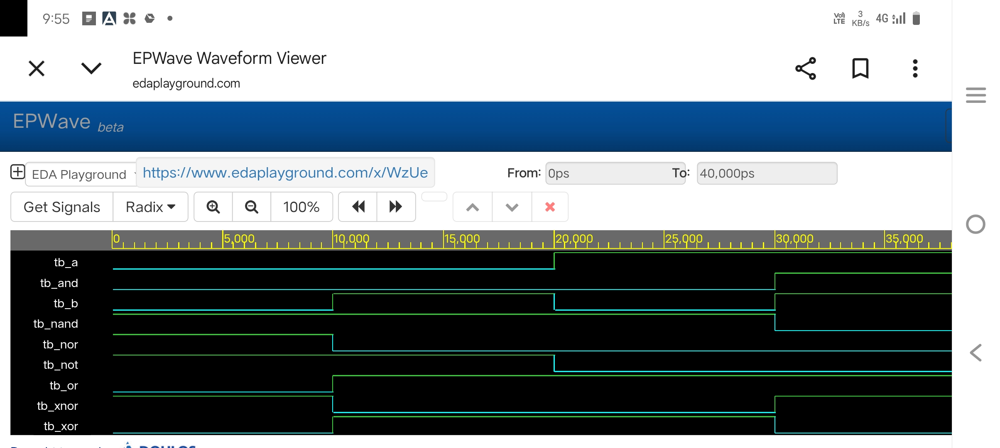

# Codtech_basic_logic_gates
BASIC LOGIC GATES
# Basic Logic Gates Implementation using Verilog HDL

## 📌 Project Overview
- **Company Name:** CODTECH IT SOLUTIONS
- **Intern Name:** Kakarlamudi Divya
- **Intern ID:** CITS998
- **Domain:** VLSI
- **Task:** Basic Logic Gates Implementation and Testbench Verification

## Using EDA Playground:
1. 1. Open [EDA Playground]https://www.edaplayground.com/x/WzUe 
2. On the left pane, choose a simulator (e.g., **Icarus Verilog 0.9.7** or **Aldec Riviera-PRO**).
3. Check the box **"Open EPWave after run"** to visualize the waveform.
4. Click **Run** to execute and check the logs.

---

## 📂 Circuit Description
The design implements the following fundamental gates using continuous assignment (`assign` statements) with bitwise operators:

1. **AND Gate** (`a & b`)
2. **OR Gate** (`a | b`)
3. **NOT Gate** (`~a` - Inverts Input A)
4. **NAND Gate** (`~(a & b)`)
5. **NOR Gate** (`~(a | b)`)
6. **XOR Gate** (`a ^ b`)
7. **XNOR Gate** (`~(a ^ b)`)

---

## 💻 Code Structure

### 1. RTL Design (`design.sv`)
Defines the module structure, input/output ports, and the concurrent boolean expressions for each logic gate.


`timescale 1ns/1ps
module basic_gates (
    input  wire a,      // Input Signal A
    input  wire b,      // Input Signal B
    output wire y_and,  // AND Gate Output
    output wire y_or,   // OR Gate Output
    output wire y_not,  // NOT Gate Output (Inverts 'a')
    output wire y_nand, // NAND Gate Output
    output wire y_nor,  // NOR Gate Output
    output wire y_xor,  // XOR Gate Output
    output wire y_xnor  // XNOR Gate Output
);

    // Continuous assignment using bitwise operators (Dataflow Modeling)
    assign y_and  = a & b;   // Logic AND
    assign y_or   = a | b;   // Logic OR
    assign y_not  = ~a;      // Logic NOT
    assign y_nand = ~(a & b);// Logic NAND
    assign y_nor  = ~(a | b);// Logic NOR
    assign y_xor  = a ^ b;   // Logic XOR
    assign y_xnor = ~(a ^ b);// Logic XNOR

endmodule

### 2. Testbench (`testbench.sv`)
Generates stimulus for all four binary combinations (\(2^2 = 4\)) with a 10ns time delay between each state. It also features:
- `$monitor` for real-time terminal logging.
- `$dumpfile` and `$dumpvars` to generate `dump.vcd` for waveform analysis.

- 

`timescale 1ns / 1ps

module tb_basic_gates;

    // Inputs declaration (reg type for testbenches)
    reg tb_a;
    reg tb_b;

    // Outputs declaration (wire type to monitor UUT)
    wire tb_and, tb_or, tb_not, tb_nand, tb_nor, tb_xor, tb_xnor;

    // Instantiate the Unit Under Test (UUT)
    basic_gates uut (
        .a(tb_a), .b(tb_b),
        .y_and(tb_and), .y_or(tb_or), .y_not(tb_not),
        .y_nand(tb_nand), .y_nor(tb_nor), .y_xor(tb_xor), .y_xnor(tb_xnor)
    );

    // Stimulus block to test all 4 binary combinations
    initial begin
    $dumpfile("dump.vcd");
    $dumpvars;
end
    initial begin 
        // Display format for simulation console
        $monitor("Time=%0td | Input A=%b B=%b | AND=%b OR=%b NOT_A=%b NAND=%b NOR=%b XOR=%b XNOR=%b", 
                 $time, tb_a, tb_b, tb_and, tb_or, tb_not, tb_nand, tb_nor, tb_xor, tb_xnor);

        // Case 1: Binary 00
        tb_a = 0; tb_b = 0; #10;
        
        // Case 2: Binary 01
        tb_a = 0; tb_b = 1; #10;
        
        // Case 3: Binary 10
        tb_a = 1; tb_b = 0; #10;
        
        // Case 4: Binary 11
        tb_a = 1; tb_b = 1; #10;

        // Finish simulation
        $finish;
    end

endmodule

---

## 📊 Verification & Results
   
### Waveform Output

   ## 📄 Documentation
   [Download Task 3 Documentation](Task3_Documentation.pdf)
   


### Truth Table Reference


| Time (ns) | Input A | Input B | AND | OR | NOT_A | NAND | NOR | XOR | XNOR |
| :---: | :---: | :---: | :---: | :---: | :---: | :---: | :---: | :---: | :---: |
| **0** | 0 | 0 | 0 | 0 | 1 | 1 | 1 | 0 | 1 |
| **10** | 0 | 1 | 0 | 1 | 1 | 1 | 0 | 1 | 0 |
| **20** | 1 | 0 | 0 | 1 | 0 | 1 | 0 | 1 | 0 |
| **30** | 1 | 1 | 1 | 1 | 0 | 0 | 0 | 0 | 1 |

### Simulation Output Log
```text
Time=0  | Input A=0 B=0 | AND=0 OR=0 NOT_A=1 NAND=1 NOR=1 XOR=0 XNOR=1
Time=10 | Input A=0 B=1 | AND=0 OR=1 NOT_A=1 NAND=1 NOR=0 XOR=1 XNOR=0
Time=20 | Input A=1 B=0 | AND=0 OR=1 NOT_A=0 NAND=1 NOR=0 XOR=1 XNOR=0
Time=30 | Input A=1 B=1 | AND=1 OR=1 NOT_A=0 NAND=0 NOR=0 XOR=0 XNOR=1
```

---


---

## 📜 Conclusion
The design successfully models all seven basic logic gates using behavioral dataflow styles. Simulation outputs fully comply with theoretical digital logic behavior, ensuring 100% test coverage.

